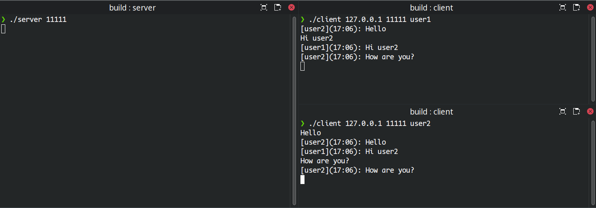

# simple-console-chat

This example is a simple chat written in C++ using the Boost.Asio library to provide asynchronous network communication.

## Requirements

- C++ compiler that supports the C++11 standard and higher.
- Boost.Asio library. [the official Boost website](https://www.boost.org/).
- CMake, make or ninja.

## How to build and run

1. Clone the repository:
   ```bash
   git clone https://github.com/yourusername/boost-asio-chat.git
   ```
2. Create build folder:
   ```bash
   mkdir build && cd build
   ```
3. Build project:
   ```bash
   cmake .. # or -G Ninja
   make # or ninja
   ```
4. Run server:
   ```bash
   chat_server <port> [<port> ...]
   ```
5. Run client:
   ```bash
   client <host> <port> <nickname>
   ```

## Usage example
1. Start the server with the selected port number.
2. Launch one or more clients by specifying the server IP address and port number.
3. Enter messages in the client console.


